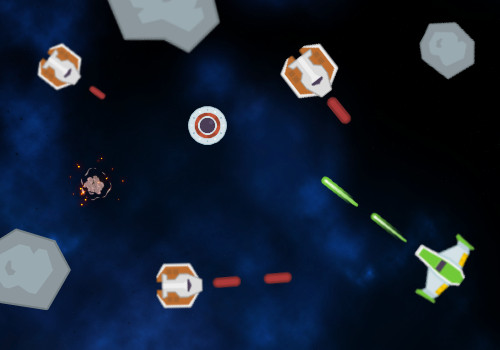
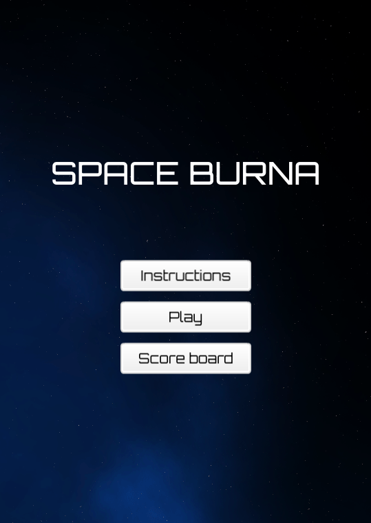
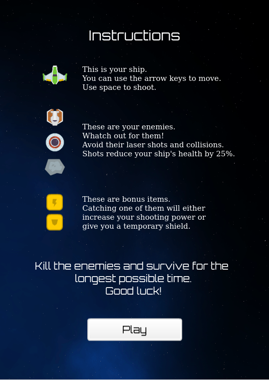
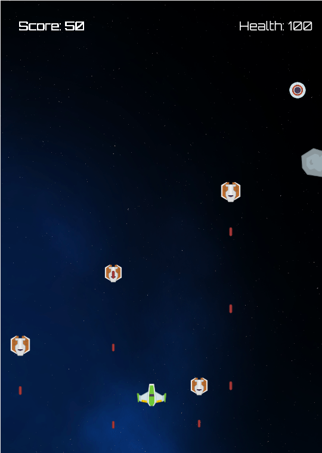
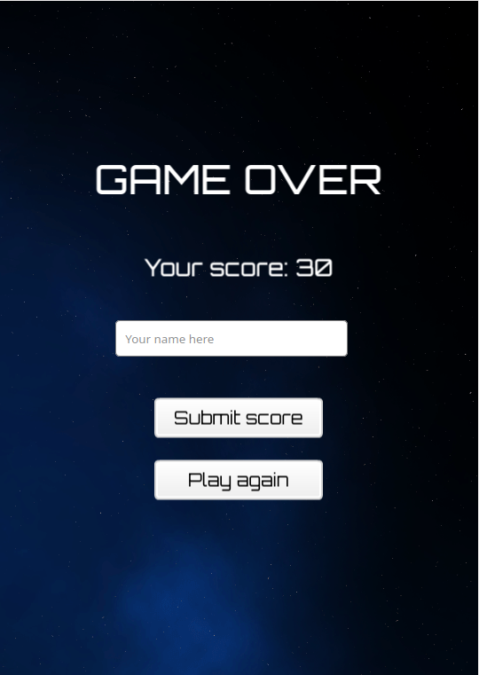
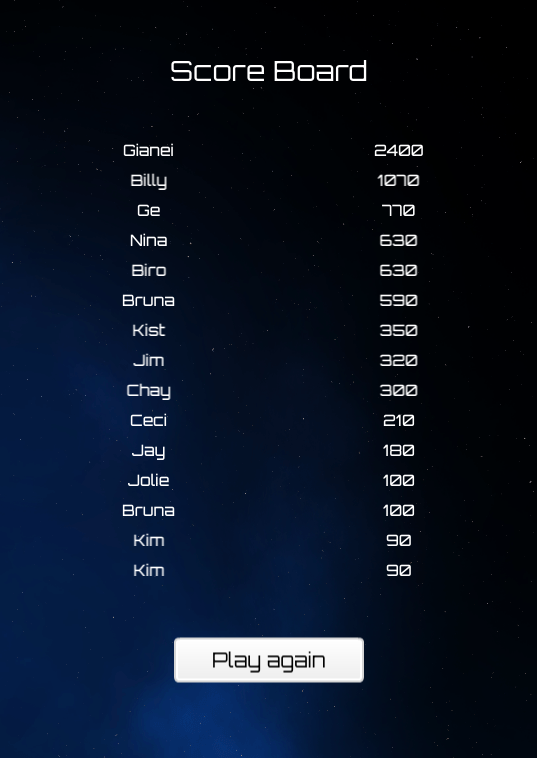

</br>   
<div align="center">
    <h1 align="center" width="90">Space Burna</h1>
    
    <a href="https://spaceburna.netlify.app/"><p>Play to save the galaxy!</p></a>
</div>

# Table of Contents

- [About](https://github.com/bruna-genz/shooter_game/blob/testing/README.md#about)
- [About the Game](https://github.com/bruna-genz/shooter_game/blob/testing/README.md#about-the-game)
  - [How to play](https://github.com/bruna-genz/shooter_game/blob/testing/README.md#how-to-play)
  - [Characters](https://github.com/bruna-genz/shooter_game/blob/testing/README.md#characters)
  - [Scenes](https://github.com/bruna-genz/shooter_game/blob/testing/README.md#scenes)
- [Prerequisites](https://github.com/bruna-genz/shooter_game/blob/testing/README.md#prerequisites)
- [Installation](https://github.com/bruna-genz/shooter_game/blob/testing/README.md#installation)
- [Build with](https://github.com/bruna-genz/shooter_game/blob/testing/README.md#build-with)
- [Author](https://github.com/bruna-genz/shooter_game/blob/testing/README.md#author)
- [Acknowledgments](https://github.com/bruna-genz/shooter_game/blob/testing/README.md#acknowledgments)

# About

This is my Capstone project for Microverse's JavaScript course. In this project, the goal was to build a shooter game using JavaScript and the game engine Phaser.

All project requirements can be seen [here](https://www.notion.so/Shooter-game-203e819041c7486bb36f9e65faecba27)

# About the Game

Space Burna is a classic shooting game that happens on the space. The goal is to survive for the longest possible time, while you destroy the enemies and avoid being shot to death. Each enemy destroied gives you 10 points. Earn enough points to see your name on the score board.

## How to play

The player controls a spaceship. Use the arrow keys on your keyboard to move around. To shoot, press enter.

## Characters

- **Player Spaceship**


This is your spaceship. You can move it up, down, left and right using the arrow keys. You can also shoot by pressing enter.
It starts the game with 100% of health. If you got shot, the health decreases by 25%, so watch out!

- **GunShip**


This enemy has the guns, and there are lots of them around the space. Luckily, they are very predictable and easy to destroy.

- **ChaserShip**


These little ship looks nice, but it will chase you down until they hit you.

- **Meteors**


Watch out for the meteors. They are big and hard to destroy.

- **Bonus items**


Finally something good! There are two kind of bonus items: 

1) Extra shooting power: it adds multiple shots. You can have up to three at the same time.
Very handy when there are a lot of enemies to destroy. However, if you got shot, your shooting power decreases.

2) Shield: this bonus will give your spaceship a temporary shield. During this time, enemies' lasers won't hit you.
Also, if you collide with an enemy, it will explode.

## Scenes

This game have five scenes:

- **Main menu**

This is the initial scene. It allows the player to start the game, go to the instructions or to the score board.



- **Instructions**

This scene presents the main rules of the game.



- **Main game**

This is the main scene of the game, where all the action happens.



- **Game Over**

This scene appears when the player collides with an enemy or if the health got to 0. It displays the score for that game and allows the player to enter their name and submit the score. It also allows to replay.



- **Score board**

This scene display the name and score of the 15 player who had the highest score on the game. Of course you will want to be the first one in that list!
It also allows the player to play again.



# Prerequisites

- Desktop computer and browser. 

# Installation

**To play online**
- Just access [this link](https://spaceburna.netlify.app/) for the live version.

**To install the game locally**
- Download or clone the [game repository](https://github.com/bruna-genz/shooter_game/tree/testing).
- Navigate to the game root directory from your terminal.
- Install the required packages with the following comand:
```
npm i
```
- Run the following command to start the game in your browser.
```
npm run start
```

# Built with
- Phaser3
- HTML5
- JavaScript
- SASS
- Webpack
- Babel

# Author
:woman: **Bruna Genz**

- Github: [@bruna-genz](https://github.com/bruna-genz)
- Twitter: [@Bruna_GK](https://twitter.com/Bruna_GK)
- Linkedin: [Bruna Genz](https://www.linkedin.com/in/brunagenz/)

# Acknowledments
- Jared, for this simple and complete [tutorial](https://learn.yorkcs.com/category/tutorials/gamedev/phaser-3/build-a-space-shooter-with-phaser-3/).
- [Kenney](https://kenney.nl/), for the beautiful assets.

# 🤝 Contributing

Contributions, issues and feature requests are welcome!

# Show your support

Give a ⭐️ if you like this project!
